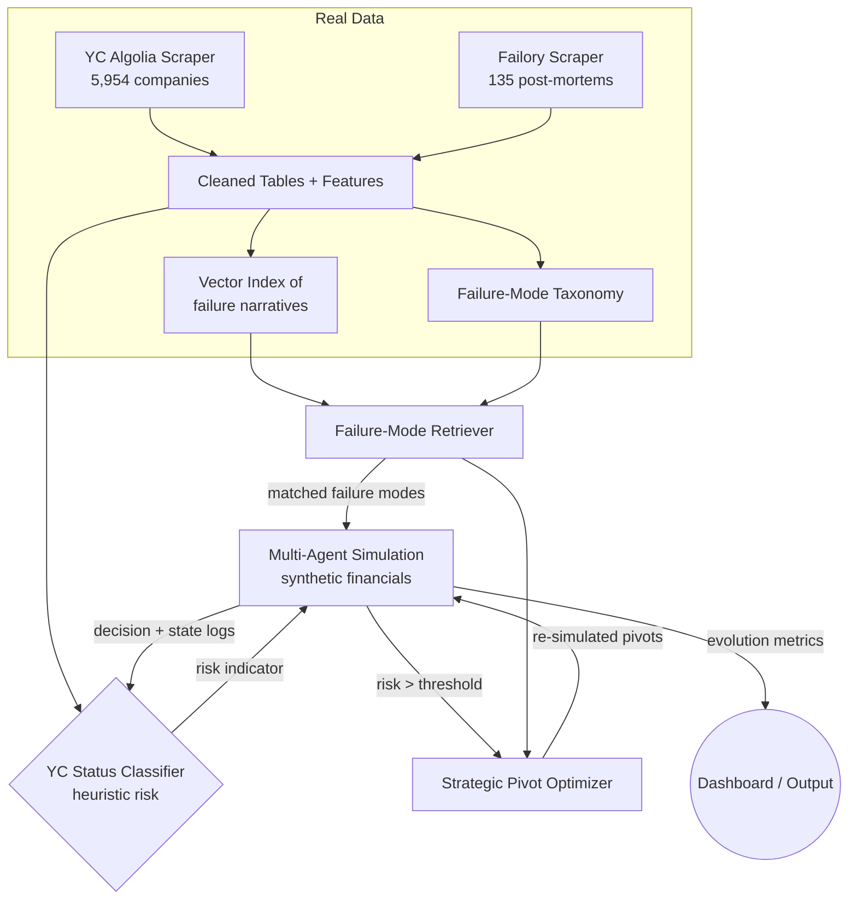

# VENTUREGENESIS: System Design Document

## 1. Introduction

**VENTUREGENESIS** is a multi-agent generative-intelligence framework for simulating startup evolution and reasoning about failure risk. It grounds its simulations and risk heuristics in two real datasets that have already been collected in this repository: a broad sample of **Y Combinator companies** (status + firmographics) and a curated set of **post-mortems from Failory** (failure reasons + narratives).

This document describes a system that can actually be built on the data we have today. Where the data is insufficient for a given capability, that limitation is called out explicitly rather than assumed away.

> **Design principle:** No component may claim to consume a signal (e.g. burn rate, MRR, runway) that does not exist in our datasets. Such signals are *simulated* inside the agent environment, not *predicted from* the historical data.

## 2. What the Data Actually Contains

All datasets live in `data/`. These are the ground truth that the rest of the system is designed around.

### 2.1. Y Combinator Dataset (`yc_companies_algolia.csv`, `yc_companies_algolia.json`)
*   **Size**: 5,954 companies (pulled batch-by-batch via the public YC Algolia index in `data/scrapers/yc_algolia_query.py`).
*   **Fields**: `id, name, slug, website, one_liner, long_description, batch, status, team_size, all_locations, industry, subindustry, tags, industries, regions, stage, isHiring, nonprofit, top_company, small_logo_thumb_url, launched_at`.
*   **Outcome label (`status`)**: `Active` (4,104), `Inactive` (1,039), `Acquired` (788), `Public` (23).
*   **Other usable signals**: `industry` (B2B 3,046; Consumer 870; Healthcare 676; Fintech 632; …), `stage` (`Early` 4,883 / `Growth` 1,071), `team_size` (populated for 5,849), `long_description` (populated for 5,554), `batch` (encodes founding cohort/age), `regions`.
*   **What is NOT here**: revenue, MRR, burn rate, runway, raised amount, valuation, time-series of any kind. The dataset is a single cross-sectional snapshot.

### 2.2. Failory Failure Dataset (`failory_dataset.csv` → `failory_dataset_enriched.csv`)
*   **Size**: 135 notable companies (scraped from Failory's "cemetery" via `data/scrapers/failory_scraper.py` and `failory_deep_scraper.py`).
*   **Base fields**: `company, description, category, country, failure_reason, outcome, started, closed, funding, employees, founders, url`.
*   **Outcome (`outcome`)**: `Shut Down` (90), `Acquired` (28), `Bankruptcy` (14), `Still Active` (3).
*   **Coarse signals**: `funding` and `employees` are *ranges* (e.g. `> $50M`, `100-250`), not exact numbers; `started`/`closed` are years (so lifespan is derivable); `founders` is a count.
*   **Enriched fields**: `meta_description` (135/135), `failure_story` (119/135). 
*   **Known enrichment gaps** (the scraper's regex heuristics did not match Failory's current page layout): `failure_reasons_detailed` 0/135, `lessons` 0/135, `investors` 1/135, `funding_detail` 5/135. These columns are effectively empty and must not be relied upon until the deep scraper is fixed.

### 2.3. Honest Data Assessment
*   **Survivorship & selection bias**: Failory only catalogs *famous* failures; YC only catalogs companies accepted into YC. Neither is a random sample of startups, so any "failure probability" produced is a heuristic over a biased population, not a calibrated real-world probability.
*   **No financial time series**: We cannot train a model on burn/runway/MRR dynamics because those columns do not exist. Such dynamics belong to the *simulation layer*.
*   **Small failure corpus**: 135 rows is far too few (and too biased) to train a robust supervised failure classifier on its own. It is best used as a **qualitative knowledge base** (taxonomy of failure modes + narrative retrieval), not as labeled training data.
*   **Usable supervised target**: The most defensible learning task is *"is a YC company Inactive vs. still operating/acquired/public?"* using categorical + text features from the YC dataset.

## 3. High-Level Architecture

The framework has four layers, each scoped to what the data can support.

1.  **Data & Knowledge Layer** — loads and cleans the YC and Failory CSV/JSON files, derives features, builds a failure-mode taxonomy, and indexes failure narratives for retrieval.
2.  **Risk Heuristics Layer** — a YC-status classifier (cross-sectional) plus a rules/retrieval-based failure-mode matcher driven by the Failory corpus. Outputs a *risk indicator*, explicitly labeled as a heuristic.
3.  **Multi-Agent Simulation Environment** — LLM-driven agents that simulate *synthetic* monthly financials and decisions, seeded with realistic distributions derived from the datasets.
4.  **Strategic Pivot Optimizer** — when simulated risk crosses a threshold, generates and re-simulates pivots, using the Failory failure-mode taxonomy and narratives as grounding context (RAG).



## 4. Core Components

### 4.1. Data & Knowledge Layer
*   **Current state (implemented)**: Three scrapers under `data/scrapers/` produce the CSV/JSON files above. Output paths in `yc_algolia_query.py` are hard-coded to `d:/DATASETS/...` and should be parameterized.
*   **To build**:
    *   A loader/cleaner (Pandas) that normalizes ranges (`funding`, `employees`) into ordinal buckets, parses `launched_at`/`batch` into a company-age feature, and derives Failory `lifespan_years = closed - started`.
    *   A **failure-mode taxonomy** built by clustering/normalizing the Failory `failure_reason` and `category` columns (e.g. "no market need", "ran out of cash", "got outcompeted", "team issues").
    *   A **vector index** of `failure_story` + `meta_description` text for semantic retrieval (used by the pivot optimizer).
*   **Fix required**: Repair `failory_deep_scraper.py` so `failure_reasons_detailed` and `lessons` actually populate (current regex assumptions don't match the live page), then re-run to enrich the corpus.

### 4.2. Risk Heuristics Layer
*   **Model A — YC Status Classifier**: A baseline tabular/text model (e.g. gradient-boosted trees over categorical features + TF-IDF or sentence embeddings of `long_description`) predicting `Inactive` vs. `not Inactive`. This is the only supervised signal the data genuinely supports.
    *   **Inputs**: `industry`, `subindustry`, `stage`, `team_size` (bucketed), company age (from `batch`/`launched_at`), `regions`, `top_company`, text embedding of the description.
    *   **Output**: A calibrated probability of being inactive, reported as a *heuristic risk indicator (0–100)*, with explicit caveats about survivorship bias.
*   **Model B — Failure-Mode Matcher**: Given a (real or simulated) startup description and metrics, retrieve the most similar Failory post-mortems and surface their failure modes. This is retrieval + light rules, not a trained model.
*   **Trigger**: Inside the simulation, if the combined risk indicator exceeds an adjustable threshold (default 75), the loop pauses and invokes the Strategic Pivot Optimizer.

### 4.3. Multi-Agent Simulation Environment
A simulated ecosystem of LLM-powered agents. Because the historical data has no financial time series, **all per-tick financial metrics (runway, MRR, burn, growth) are generated inside the simulation**, seeded with realistic starting distributions derived from the datasets (industry mix, team size, typical lifespans from Failory).

*   **Internal Agents (the startup team)**:
    *   `CEO Agent` — fundraising, high-level strategy, pivot approvals.
    *   `CTO Agent` — technical debt, product velocity, feature selection.
    *   `CMO Agent` — acquisition strategy, marketing spend, positioning.
*   **External Agents (the environment)**:
    *   `Market Agent` — demand, competitor moves, macro conditions.
    *   `Investor/VC Agent` — evaluates pitches, extends runway, sets growth expectations.
*   Each "tick" represents one month of startup life; agents read and update the shared Startup State (Section 5).

### 4.4. Strategic Pivot Optimizer
*   **Mechanism**: Generative AI proposes pivots grounded in the startup's simulated state plus retrieved Failory failure modes ("companies that failed for reason X recovered/avoided it by Y").
*   **Process**:
    1.  **Diagnosis** — identify the dominant simulated failure driver and the closest historical failure modes (Model B).
    2.  **Ideation** — generate 3–5 distinct pivot scenarios.
    3.  **Simulation** — briefly re-run each pivot through the agent environment.
    4.  **Recommendation** — return the pivot with the highest simulated survival rate to the `CEO Agent`.

## 5. Data Models & State Management

State is passed between agents and the risk layer every tick. Fields are split into **seeded-from-data** (initialized from real datasets) and **simulated** (evolved by the agents).

```json
{
  "startup_id": "vg-001",
  "iteration": 12,
  "seeded_from_data": {
    "industry": "Fintech",
    "stage": "Early",
    "team_size_bucket": "1-10",
    "region": "United States of America",
    "description": "AI-native billing for SMB lenders"
  },
  "simulated_metrics": {
    "runway_months": 8,
    "mrr": 5000,
    "burn_rate": 20000,
    "user_growth_rate": 0.05,
    "market_fit_score": 0.4
  },
  "risk": {
    "yc_status_risk": 0.61,
    "matched_failure_modes": ["ran out of cash", "no market need"],
    "risk_indicator": 0.78,
    "is_heuristic": true
  },
  "current_strategy": "B2C Subscription",
  "tech_debt_level": "Medium"
}
```

> Note the explicit `seeded_from_data` vs. `simulated_metrics` separation and the `is_heuristic` flag — this keeps the system honest about which numbers are grounded and which are synthetic.

## 6. Technology Stack

Chosen to be runnable on the data we have, without over-engineering.

*   **Core logic & orchestration**: Python 3.10+
*   **Multi-agent framework**: CrewAI or AutoGen
*   **LLM provider**: OpenAI GPT-4o / Anthropic Claude 3.5 Sonnet (agent reasoning, pivot generation)
*   **Data processing & ML**: Pandas + scikit-learn (cleaning, feature engineering, baseline classifier); optional XGBoost/LightGBM for Model A
*   **Embeddings & retrieval**: sentence-transformers + a lightweight vector store (FAISS or Chroma) for the 135-doc Failory corpus — a managed vector DB is unnecessary at this scale
*   **Storage**:
    *   Files: CSV/Parquet in `data/` (already the source of truth)
    *   SQLite or DuckDB for simulation state and run logs (zero-ops, sufficient for this scale)
*   **Optional / future** (not required by current data): PostgreSQL for multi-user runs; Neo4j for founder→startup→market graphs; Crunchbase or other paid sources to add real financials. These are explicitly out of scope until the data justifies them.

## 7. Development Milestones

*   [x] **Phase 1 — Data Foundation**: Scrapers for YC (5,954) and Failory (135) implemented; raw datasets collected.
*   [ ] **Phase 1.5 — Data Repair & Cleaning**: Parameterize scraper output paths, fix the Failory deep scraper so `failure_reasons_detailed`/`lessons` populate, normalize ranges, derive age/lifespan features, build the failure-mode taxonomy and vector index.
*   [ ] **Phase 2 — Risk Heuristics**: Train and calibrate the YC status classifier (Model A); build the Failory failure-mode retriever (Model B). Report metrics honestly with bias caveats.
*   [ ] **Phase 3 — Agent Architecture**: Implement internal and external agents on CrewAI/AutoGen, seeding initial state from real dataset distributions.
*   [ ] **Phase 4 — Simulation Loop**: Connect agents to a monthly "clock" that evolves the simulated financial metrics and shared state.
*   [ ] **Phase 5 — Pivot Optimization**: Build the generative pivot module grounded in the Failory taxonomy/narratives; re-simulate and rank pivots.
*   [ ] **Phase 6 — Visualization**: Dashboard to observe startup evolution, agent dialogues, risk indicators, and pivot events, with clear labeling of heuristic vs. simulated values.
